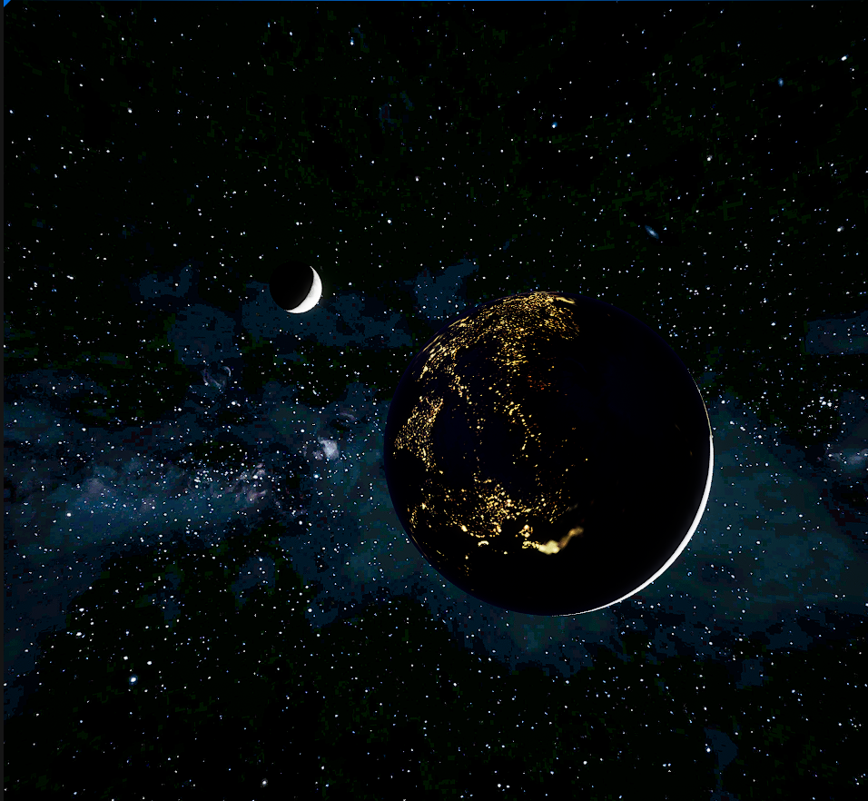
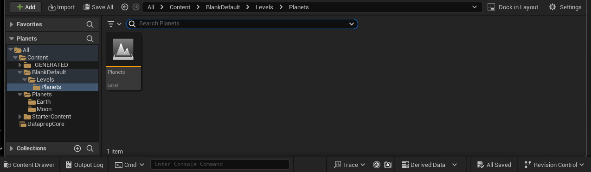

# Demo: Earth and Moon

---

## Earth Material Recipe

## Earth Clouds Material Recipe

## Earth Atmosphere Material Recipe 

## Moon Material Recipe

## Stars Material Recipe

### Download the textures [here](https://www.solarsystemscope.com/textures/)

---

If you want to run my project, here is the level location:

